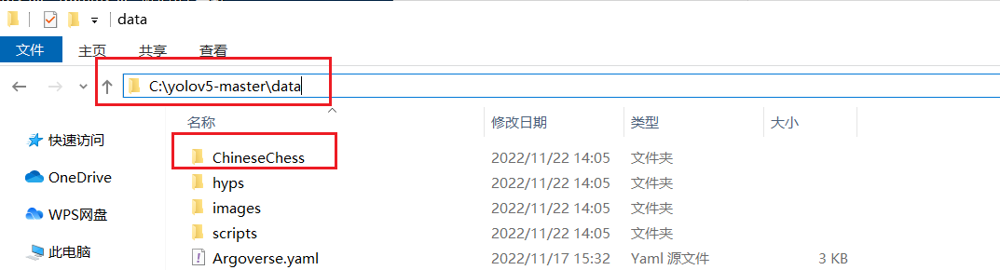
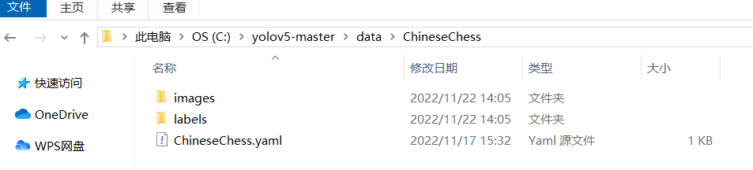
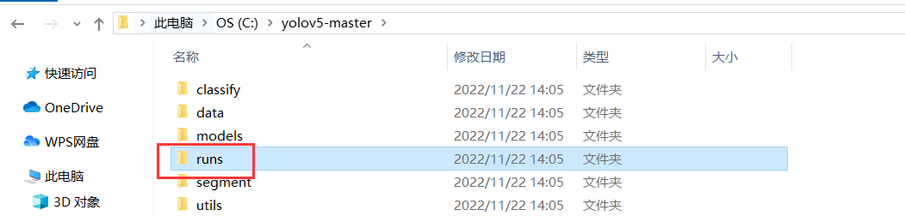
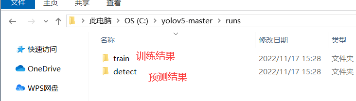

## 识别中国象棋的黑卒红兵

```
FILELIST
│  yolov5-master.zip 训练及预测工具
├─datasets_tool 数据集辅助工具
│  │  generate_rotate_imgsets.py 图片旋转工具
│  ├─source 原始图像输入目录
│  └─result 数据集输出目录
├─ChineseChess
│  │   datasets.zip 用于训练的数据集
│  │   model.zip 训练输出的模型及预测结果
│  └─predict 本地进行预测
```

训练前需将数据集放到 `data` 目录下：





训练结果会生成在 `run` 文件夹中：



