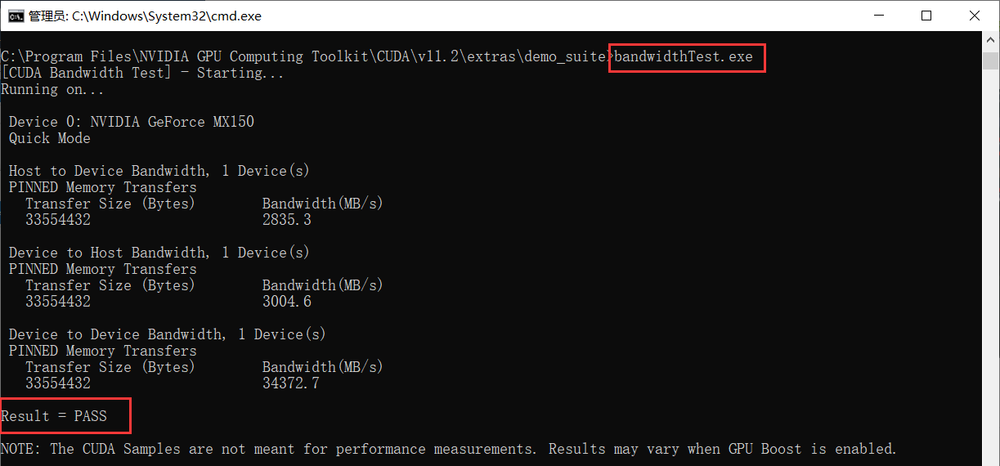

# 2022.11.29

ASUS ZenBook（MX150）+ Win10

[支持情况][https://www.nvidia.cn/geforce/gaming-laptops/geforce-mx150/]


### Environment

#### Driver

默认安装适合自己的显卡驱动即可。

#### CUDA

##### Install

1. CUDA version

安装驱动后查看最高支持的CUDA版本。


2. [tensorflow-gpu][https://tensorflow.google.cn/install/source_windows#gpu] version


根据 Python 版本选择 tensorflow-gpu 版本、cuDNN、CUDA 版本。

因我电脑安装的是 Python 3.10，所以我选择安装 tensorflow-gpu-2.11，cuDNN-8.1，CUDA-11.2。(注：对应的 python 版本才能找到对应的 tensorflow-gpu 库)


2. uninstall CUDA

卸载旧的：


3. install [CUDA][https://developer.nvidia.com/cuda-toolkit-archive]


安装 - 自定义


##### Test

获取版本号：`nvcc -V` / `nvcc -version`


##### Env

不需要编辑环境变量，只是查看而已。


#### [cuDNN][https://developer.nvidia.com/rdp/cudnn-archive]

##### Install


点击下载，得到压缩包，并解压到对应文件夹里。

```
C:\Program Files\NVIDIA GPU Computing Toolkit\CUDA\v11.2
```


##### Test

查看显卡信息：`nvidia-smi`


##### Test

```
C:\Program Files\NVIDIA GPU Computing Toolkit\CUDA\v11.2\extras\demo_suite
```

```
bandwidthTest.exe
deviceQuery.exe
```




#### TensorFlow

##### Install

```shell
pip install tensorflow-gpu==2.11
```

##### Test

测试 GPU 是否可用：

```python
from tensorflow.python.client import device_lib
print(device_lib.list_local_devices())
```


若出现找不到 dll 的情况，将 `C:\Program Files\NVIDIA GPU Computing Toolkit\CUDA\v11.2\bin` 里的文件复制到 `C:\Windows\System32` 里。

GPU 使用情况：


##### Test

```python
import tensorflow as tf
tf.config.experimental.list_physical_devices('GPU')
```


