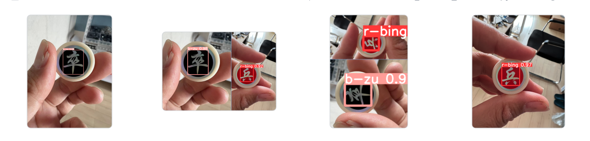

https://doc.itprojects.cn/0007.zhishi.raspberrypi/02.doc/index.html#/c01.yolo5

### [YOLO][https://pjreddie.com/darknet/yolo/]

`YOLO`（`You Only Look Once`）是一种基于深度神经网络的对象识别和定位算法，其最大的特点是运行速度很快，可以用于实时系统。


### 图片集生成

1. 拍张图片


2. 截取目标区域


3. 将图片绕每个角度进行1次旋转

建立 `images`、`result` 文件夹，然后将图片 `b-zu.png` 复制到`images`中，运行下述代码。

```python
from math import *
import cv2
import os
import glob
import imutils
import numpy as np

def rotate_img(img, angle):
    '''
    img   --image
    angle --rotation angle
    return--rotated img
    '''
    h, w = img.shape[:2]
    rotate_center = (w / 2, h / 2)
    # 获取旋转矩阵
    # 参数1为旋转中心点;
    # 参数2为旋转角度,正值-逆时针旋转;负值-顺时针旋转
    # 参数3为各向同性的比例因子,1.0原图，2.0变成原来的2倍，0.5变成原来的0.5倍
    M = cv2.getRotationMatrix2D(rotate_center, angle, 1.0)
    # 计算图像新边界
    new_w = int(h * np.abs(M[0, 1]) + w * np.abs(M[0, 0]))
    new_h = int(h * np.abs(M[0, 0]) + w * np.abs(M[0, 1]))
    # 调整旋转矩阵以考虑平移
    M[0, 2] += (new_w - w) / 2
    M[1, 2] += (new_h - h) / 2

    rotated_img = cv2.warpAffine(img, M, (new_w, new_h))
    return rotated_img


if __name__ == '__main__':

    output_dir = "result" 
    image_names = glob.glob("images/b-zu.png")

    for image_name in image_names:
        image = cv2.imread(image_name, -1)

        for i in range(1, 361): # 旋转 360 次（共生成360张图）
            rotated_img1 = rotate_img(image, i)
            basename = os.path.basename(image_name)
            tag, _ = os.path.splitext(basename)
            cv2.imwrite(os.path.join(output_dir, 'b-zu-%d.jpg' % i), rotated_img1)

```

### 图片标记工具

1. 安装：

```
pip install labelimg -i https://pypi.tuna.tsinghua.edu.cn/simple
```

2. 运行：labelimg

| Win+R                                                        | CMD                                                          |
| ------------------------------------------------------------ | ------------------------------------------------------------ |
|  |  |

3. 配置


4. 标记图片

按`w`出现十字叉

鼠标左键按住并拖动选择区域

松开鼠标左键

输入标签名称

按`d`切换下一张图片

5. 标记结果

每张图片生成1个以后缀为`txt`的文本文件。

类别、被标记内容位置和尺寸（class,x,y,w,h）

类别（class+1） 对应文件 `classes.txt` 的行号。

### GPU 云服务器：[矩池云][https://www.matpool.com/host-market/gpu]

Nivida 显卡 + CUDA：训练模型时支持 `GPU` 加速 （用 CPU 训练太慢了）

#### 网盘使用

使用网盘直接挂载到GPU服务器，方便将代码等文件传到GPU服务里。


**下载**地址 & 内测码获取：https://www.matpool.com/download/netdisk


**注册**：邀请码 mgLMqG3ujiP3LAO

奖励是此月底过期得118元满减券，单次不满指定金额是不会自动抵扣的。


**安装**并**登录**，直接拖拽文件**上传**即可。

我的内测码：AA45147FAF720A79D1DB6BD87A9E8EE8


#### 选择服务器

小白就租个最便宜的熟悉下流程就行：


灵活使用就是按实际使用时间计费：即账户里只有1元，也可选4元的，按分钟计费。


#### 连接服务器


验证是否可以用GPU加速训练：输入 `python` ，运行以下代码

```python
import torch
print(torch.cuda.is_available())
```

#### 训练模型

1. 进入目录：

```shell
cd /mnt/yolov5-master
```

2. 训练模型：

```sh
python3 train.py --weights yolov5s.pt --data data/ChineseChess/ChineseChess.yaml --workers 8 --batch-size 20 --epochs 50
```

* data：数据集路径等参数配置文件。（需将 `demos/ChineseChess/datasets.zip` 里的内容解压到 `yolov5-master/data` 文件夹中）
* works：使用的 GPU 核数。


* epochs：训练次数。实测此数据集在 `Tesla k80` 中 1轮/分钟，在 `RTX 3080 Ti` 中 4轮/分钟。


训练完成：


3. 识别图像：

将训练结果复制到 yolov5-master 文件夹里


```sh
python3 detect.py --weight last.pt --source data/ChineseChess/images/test
```

* weight：权重文件。
* source：测试集。


查看识别结果：下载文件夹，查看里面的图片。



